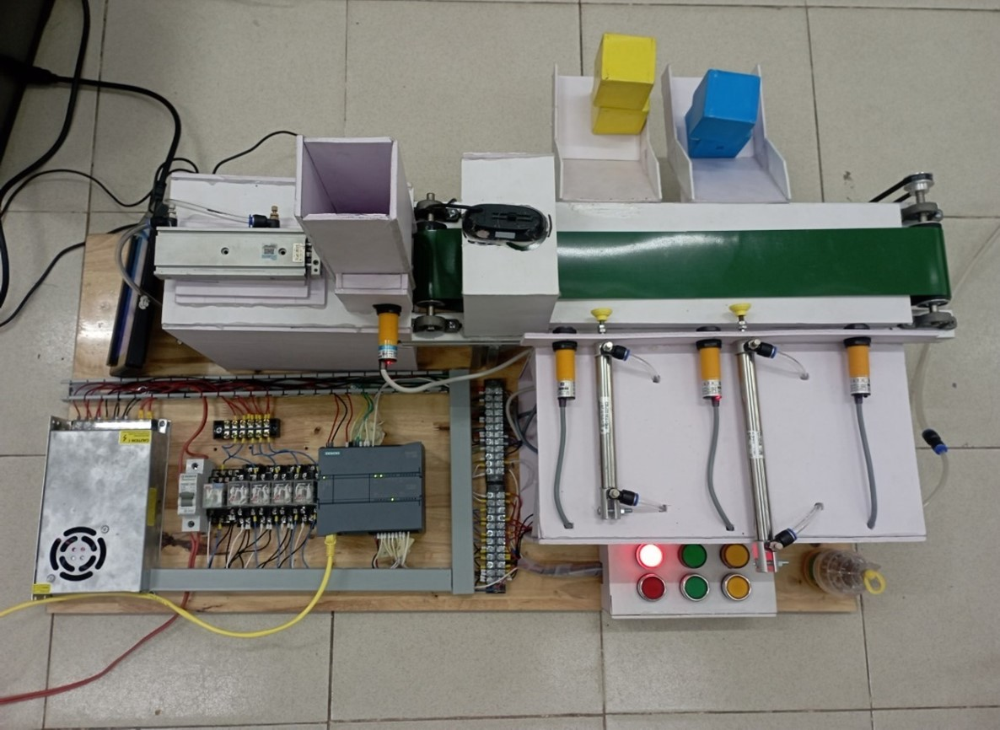
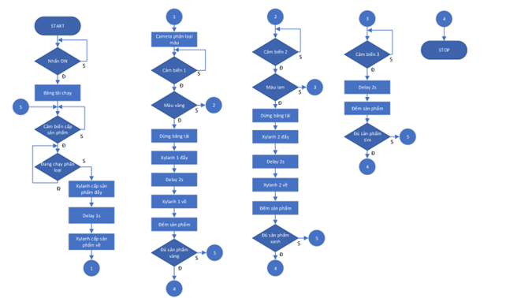

 <h1 align="center">Project on Programmable Logic Controller</h1>

# Introduction
This project designs and constructs a product classification model by color using PLC Simens S7-1200 combined with image processing applications. In this project, we use Computer Vision to detect three different colors such as Yellow, Blue and Purple. After that, we communicate with PLC S7-1200 through Modbus TCP/IP Protocol. The version of TIA Portal is v16.

# System design and construction
The product classification system by color works on the basis of processing color scanned images of each product. The colors are sent to the computer and processed and then put into the PLC, the PLC is responsible for processing and emitting signals to control the cylinder to push the product into the corresponding container. Products that are not among the products that need to be sorted are taken to the end of the conveyor and dropped into the defective product container. This system is repeated continuously along with packaging, labeling and storage lines to create a complete production line of the factory.

The hardware of the system includes: control devices (PLC, relay), actuators, motors, conveyors, pneumatic cylinders, Camera Logitech C270, sensors.

   
  <i>System model built</i>

The system algorithm flowchart is shown below:

   
  <i>Quadcopter hardware overview</i>

In this project, we use Camera Logitech C270 to apply Optical Flow to calculate drift from the Center of Frame and TF-Lunar 1D Lidar to calculate height of the Quadcopter. After that, we use that two-signal to control Quadcopter through two PID-controller. The protocol we use to control Quadcopter is YAMSPy (Yet Another Multiwii protocol).

# Optical Flow algorithm
The image processing algorithm used in the project is presented as the flowchart below:

   
  <i>Flowchart of image processing algorithm</i>

The above diagram shows the whole process of finding the displacement vector to generate the input value for balancing. First, the camera will read the first image frame, then flatten the image from the parameters after the camera Calibration because the image retrieved from the camera will be curved so the displacement vector will be incorrect. Then convert the image frame to grayscale. Because after flattening the image, the edge of the image will appear as a cut angle, making the Harris Corner algorithm recognize it as a keypoint, which will cause errors in the vector calculation. That's why we have to cut the center part. Then, using Harris Corner algorithm to find keypoints in the image frames. Then use Optical flow algorithm to calculate the displacement between frames and get the corresponding Displacement Vector value.

   
  <i>Displacement Vector Calculation Process</i>

However, there are still cases that cause the process to be terminated. That is when the Quadcopter moves too far from the original point (50cm), the image processing algorithm will end. Then, Quadcopter will update the Keypoints and start the image processing again.

# Build a PID controller
The first controller is the altitude controller. In order for the Quadcopter to maintain altitude, the control signal value is the Throttle control pulse output value. In order for the Quadcopter to maintain the desired altitude, the PID controller value needs to be calibrated so that the Throttle value is calculated around the equilibrium working point.

   
  <i>Block diagram of position PID controller</i>

   
  <i>General controller of the system</i>

# Results and reviews
To facilitate the control and monitoring of the robot's activities, the matching variable values, the work coordinates. The team created the console on the Sublime Text software using the Python language.
- **Evaluation of image processing algorithms:**
Because the camera is always curved, the value of the image processing algorithm is often wrong. Therefore, the process of camera calibration plays a very important role.

   
  <i>Camera calibration process</i>

- **Optical Flow algorithm results:**
Result of applying PLK (Pyramid Lucas – Kanade) algorithm when there are few features (left figure).
Result of applying PLK (Pyramid Lucas – Kanade) algorithm when there are many features (right figure).

  
  

- **Evaluation of the PID controller:**
The PID controller applies to the Drone model to control altitude and position hold.

   
  <i>Result of PID controller holding altitude</i>

   
  <i>Realistic results quadcopter keeps altitude and position</i>

# Video
https://youtu.be/sdybXYhyMzA
